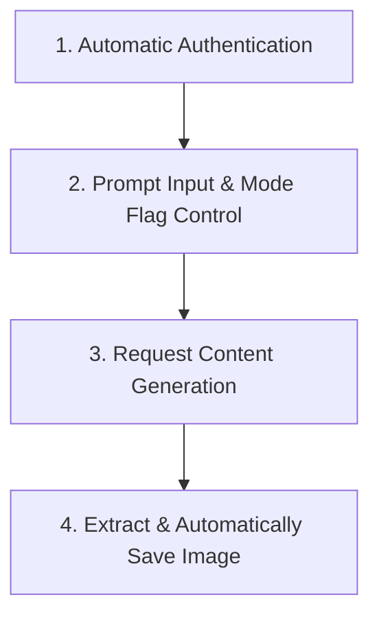

# Automatic Image Generation and Storage Project Guide

This guide explains how to build a project using the `gemini-webapi` library that dynamically receives a prompt (from code or a user), performs image generation, automatically downloads and stores the generated image to a specified directory, controls the image generation flags, and handles authentication automatically on every run.

---

## 1. Project Architecture Overview

The project workflow consists of four main phases:



1. **Automatic Authentication**: The client is initialized to grab cookies directly from the active browser session, removing the need to manage expired credentials manually.
2. **Prompt & Mode Flag Control**: The prompt text is provided, and the `image` mode flag is toggled to control whether Gemini generates an image (`image=True`) or standard text.
3. **Request Generation**: The client sends the payload using `generate_content`.
4. **Extract & Save**: Any generated image is detected, and its high-resolution original is saved directly to the user's preferred directory.

---

## 2. Detailed Technical Breakdown

### A. Automatic Authentication
To avoid hardcoding sensitive token strings (like `__Secure-1PSID` and `__Secure-1PSIDTS`) which expire frequently, you can configure [GeminiClient](file:///Volumes/hard-drive/gemini-cli-test/Gemini-API/src/gemini_webapi/client.py#L77) to automatically read and use the current authenticated session of your local browser (using `browser-cookie3` internally).

Initialize the client with:
*   `prefer_browser_cookies=True`: Forces the initialization routine to scan local browser directories first.
*   `skip_cookie_cache=True`: Skips stale cached cookies on disk to guarantee a fresh authentication attempt each time.

```python
from gemini_webapi import GeminiClient

client = GeminiClient(
    prefer_browser_cookies=True,
    skip_cookie_cache=True,
)
await client.init()
```

### B. Controlling the Image Generation Flag
The `image` parameter controls the output mode of the client.
*   **`image=False`** (Default): Prompts are sent to the standard text generation endpoint.
*   **`image=True`**: The client automatically transitions to Google Gemini's dedicated images mode. It sets the proper model parameters and selects the underlying image mode identifier (`56fdd199312815e2`) before making the request.

This parameter is supplied directly to the generation call:
```python
response = await client.generate_content(
    prompt="A futuristic city in the rain, synthwave style",
    image=True
)
```

### C. Automatic High-Resolution Saving
Once Gemini responds, the generated image objects are returned as instances of [GeneratedImage](file:///Volumes/hard-drive/gemini-cli-test/Gemini-API/src/gemini_webapi/types/image.py#L164) in the `response.images` list.

Calling `await image.save(path="your_directory", filename="your_filename.png")` does the following:
1. Calls the internal `_get_full_size_image` RPC method to retrieve the original, uncompressed image URL from Google's content servers.
2. Appends `=s2048-rj` (or the respective high-resolution modifier) to fetch the full 2K version.
3. Performs the download stream and writes the file binary directly into your chosen path.

---

## 3. Complete Project Implementation Example

Below is a complete, production-ready script showing how to build this pipeline.

```python
import asyncio
import os
from pathlib import Path
from gemini_webapi import GeminiClient
from gemini_webapi.exceptions import GeminiError, AuthError

async def generate_and_save_image(
    prompt: str, 
    output_dir: str = "output_images", 
    base_filename: str = "generated_output",
    image_mode: bool = True
):
    """
    Handles automatic authentication, sends a prompt to Gemini with configurable 
    mode flags, and saves any returned images to the desired local directory.
    """
    
    # 1. Initialize client with automatic browser cookie detection
    client = GeminiClient(
        prefer_browser_cookies=True,
        skip_cookie_cache=True
    )
    
    print("Initializing client & fetching browser cookies automatically...")
    try:
        await client.init()
    except AuthError as e:
        print(f"Authentication failed: {e}")
        print("Please check that you are logged into gemini.google.com in your web browser.")
        return
    except Exception as e:
        print(f"Failed to initialize client: {e}")
        return

    try:
        print(f"Sending prompt: '{prompt}' (image_mode={image_mode})")
        
        # 2. Call the generator while controlling the image generation flag
        response = await client.generate_content(
            prompt=prompt,
            image=image_mode
        )
        
        # 3. Handle generated images
        if response.images:
            # Ensure the output directory exists
            output_path = Path(output_dir)
            output_path.mkdir(parents=True, exist_ok=True)
            
            print(f"Detected {len(response.images)} generated image(s). Saving automatically...")
            
            for index, img in enumerate(response.images):
                # Formulate a unique name for each image variant
                filename = f"{base_filename}_{index + 1}.png"
                
                # Automatically request the high-resolution source and download to disk
                saved_path = await img.save(
                    path=str(output_path),
                    filename=filename,
                    verbose=True
                )
                print(f"Successfully saved image {index + 1} to: {saved_path}")
        else:
            print("No images were returned by the model.")
            if response.text:
                print(f"Model Response Text:\n{response.text}")
                
    except GeminiError as e:
        print(f"Gemini API error occurred: {e}")
    except Exception as e:
        print(f"An unexpected error occurred during execution: {e}")
    finally:
        # Always close the client session to free resources
        await client.close()

# Example Usage
if __name__ == "__main__":
    # Prompt and destination options can be customized here or loaded from a config file
    user_prompt = "A cute fluffy kitten playing with a ball of yarn, highly detailed"
    destination_folder = "./my_custom_downloads"
    output_prefix = "kitten_yarn"
    
    # Run the pipeline
    asyncio.run(
        generate_and_save_image(
            prompt=user_prompt,
            output_dir=destination_folder,
            base_filename=output_prefix,
            image_mode=True  # Switch to False to send as normal text prompt
        )
    )
```

---

## 4. Key Advanced Features

### A. Quota & Usage Limit Monitoring
The library allows you to check your account's remaining quota limits directly from Google's servers using `client.get_usage()`. It returns a list of metrics containing the usage level, the limit threshold, and the exact reset time for both short-term (daily) and long-term (weekly premium) usage.

```python
usage_info = await client.get_usage()
for meter in usage_info.get("meters", []):
    print(f"Feature ID: {meter['feature_id']}")
    print(f"Usage: {meter['usage']}")
    print(f"Limit: {meter['limit']}")
    print(f"Resets At: {meter['reset_time']}")
```

### B. Persistent Retry Logic
To counter rate limits or transient API glitches, calling `chat.send_message(..., image=True)` uses a 4-attempt retry workflow under the hood:
1. **Attempts 1, 2, and 3**: Executed in the same chat window context with exponential backoff delays.
2. **Attempt 4**: If previous attempts fail, it clears the session variables (`self.__metadata`) to start a new chat window on Google's servers for one final generation attempt.

---

## 5. CLI Commands Reference

When using the custom bulk image generation tool [generate_images.py](file:///Volumes/hard-drive/gemini-cli-test/image-generator/generate_images.py), you have access to the following terminal commands:

*   **Run/Resume Generation**: Scans markdown files for `<!-- IMAGE_PROMPT -->` comment tags, cross-checks with `image_generation_log.jsonl`, and processes the remaining images:
    ```bash
    python image-generator/generate_images.py "/Volumes/hard-drive/Generate-auto-book/orielly-book/Hands-On Large Language Models 9781098150952/pipeline/final"
    ```
*   **Show Statistics Only**: Checks how many images have been completed and how many are remaining without running the queue:
    ```bash
    python image-generator/generate_images.py "/Volumes/hard-drive/Generate-auto-book/orielly-book/Hands-On Large Language Models 9781098150952/pipeline/final" --stats
    ```
*   **Print Usage Limits**: Queries Google's servers and displays remaining image quotas and reset times:
    ```bash
    python image-generator/generate_images.py --usage
    ```

---

## 6. Key Best Practices

1. **Browser Selection**: If you have multiple browsers, the client tries to detect active sessions. Make sure you are actively logged in to [gemini.google.com](https://gemini.google.com) on your primary default browser.
2. **Directory Permissions**: Ensure the script has read and write permissions for the destination folder you specify in `output_dir`.
3. **Client Resource Disposal**: Always call `await client.close()` in a `finally` block or use context managers to guarantee that open HTTP sessions are closed cleanly.

